# mlops-pytorch-pipeline

Production-style MLOps pipeline that takes a PyTorch image classifier (CIFAR-10, ResNet-18)
from local development through Docker containerization to orchestrated deployment on
Kubernetes, including training Jobs, a served REST API, health checks, ConfigMaps and
autoscaling.

## Architecture

```mermaid
flowchart LR
    subgraph Dev["Local Development"]
        A[src/model.py<br/>src/dataset.py] --> B[src/train.py]
        B --> C[checkpoints/*.pt]
    end

    subgraph Docker["Docker Images"]
        D[docker/Dockerfile.train] --> E[mlops-train:v1]
        F[docker/Dockerfile.serve] --> G[mlops-serve:v1]
    end

    subgraph K8s["Kubernetes (namespace: ml-training)"]
        H[ConfigMap<br/>training-config] --> I[Job<br/>training-job]
        PVC1[(PVC: data)] --> I
        PVC2[(PVC: checkpoints)] --> I
        I -->|writes checkpoint| PVC2
        PVC2 -->|read-only mount| J[Deployment<br/>model-serving x2]
        J --> K[Service<br/>ClusterIP :80]
        J --> L[HPA]
    end

    C -.image build.-> E
    C -.image build.-> G
    E -.-> I
    G -.-> J
    K --> M[curl /predict]
```



## Repository structure

```
mlops-pytorch-pipeline/
├── README.md
├── .gitignore
├── .github/workflows/ci.yml     # lint, test, docker build validation
├── src/
│   ├── model.py                 # ResNet-18 / CNN classifier
│   ├── dataset.py                # CIFAR-10 loading + transforms
│   ├── train.py                  # training loop, early stopping, JSON logs
│   └── serve.py                  # FastAPI inference service
├── configs/training_config.yaml
├── docker/
│   ├── Dockerfile.train           # multi-stage training image
│   └── Dockerfile.serve           # slim, non-root serving image
├── k8s/
│   ├── namespace.yaml
│   ├── configmap.yaml
│   ├── training-job.yaml
│   ├── serving-deployment.yaml
│   ├── serving-service.yaml
│   └── hpa.yaml
├── requirements/
│   ├── train.txt
│   ├── serve.txt
│   └── dev.txt
└── tests/test_model.py
```

## Git workflow

- `main` — production-ready, protected, updated only via merged PRs from `develop`.
- `develop` — integration branch for completed features.
- `feature/*` — one branch per unit of work (see PR history), merged into `develop` via PR.
- Commit messages follow [Conventional Commits](https://www.conventionalcommits.org/).

## Setup instructions

### 1. Local environment

```bash
python -m venv .venv
.venv\Scripts\activate        # Windows
pip install -r requirements/train.txt -r requirements/serve.txt -r requirements/dev.txt
```

### 2. Train locally

```bash
python src/train.py
```

Reads `configs/training_config.yaml` (or `/app/configs/training_config.yaml` when
containerized) and writes a checkpoint to the configured `output.checkpoint_dir`.

### 3. Serve locally

```bash
uvicorn src.serve:app --host 0.0.0.0 --port 8080
```

### 4. Docker

```bash
# Training image
docker build -f docker/Dockerfile.train -t mlops-train:v1 .
docker run --rm -v ${PWD}/data:/app/data -v ${PWD}/checkpoints:/app/checkpoints mlops-train:v1

# Serving image
docker build -f docker/Dockerfile.serve -t mlops-serve:v1 .
docker run --rm -p 8080:8080 -v ${PWD}/checkpoints:/app/checkpoints mlops-serve:v1

# Test
curl -X POST http://localhost:8080/predict -F "image=@test_image.png"
```

### 5. Kubernetes

```bash
kubectl apply -f k8s/namespace.yaml
kubectl apply -f k8s/configmap.yaml
kubectl apply -f k8s/training-job.yaml
# after the Job completes:
kubectl apply -f k8s/serving-deployment.yaml
kubectl apply -f k8s/serving-service.yaml
kubectl apply -f k8s/hpa.yaml

kubectl get pods -n ml-training
kubectl port-forward svc/model-serving 8080:80 -n ml-training
curl -X POST http://localhost:8080/predict -F "image=@test_image.png"
```

## Status

Project scaffolding in progress — see open/merged PRs for incremental delivery of the
model, Docker images, and Kubernetes manifests.